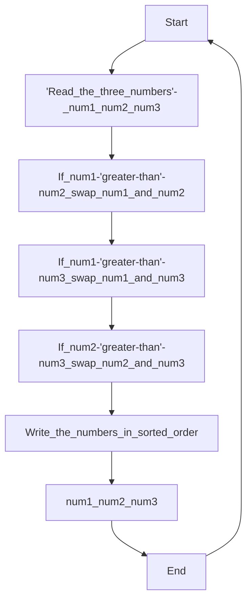

```mermaid
graph TD;
    Start-->'Read_the_three_numbers'-_num1_num2_num3;

	'Read_the_three_numbers'-_num1_num2_num3-->If_num1-'greater-than'-num2_swap_num1_and_num2;
  If_num1-'greater-than'-num2_swap_num1_and_num2-->If_num1-'greater-than'-num3_swap_num1_and_num3;
If_num1-'greater-than'-num3_swap_num1_and_num3-->If_num2-'greater-than'-num3_swap_num2_and_num3;
If_num2-'greater-than'-num3_swap_num2_and_num3-->Write_the_numbers_in_sorted_order;
Write_the_numbers_in_sorted_order-->num1_num2_num3
num1_num2_num3-->End
End-->Start

    
``` 
